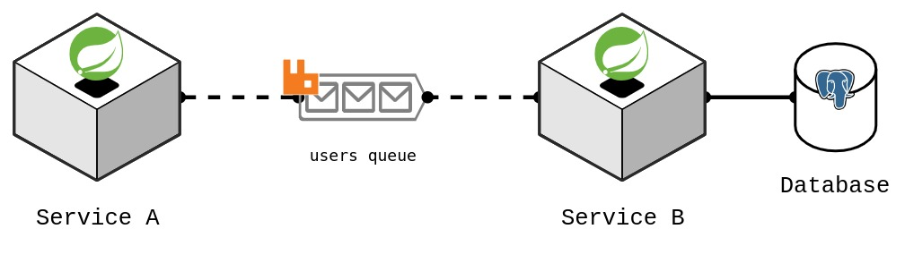

# RabbitMQ + Spring Boot simple example
<p align="center">
  <a href="https://github.com/Throyer/rabbitmq-poc" target="blank">
    
  </a>
</p>

## How to use
> 🚨 create `environment` file and add permission to execute scripts
>
> ```shell
> cp .docker/.env.example .docker/.env && chmod -R +x .docker/scripts
> ```

  - start containers
    ```
    .docker/scripts/develop up -d --build
    ```

  - show logs
    ```
    .docker/scripts/develop logs -f service-a service-b
    ```

  - send user to `Service A`
    ```http
    POST http://localhost:8081/api/v1/users
    ```
    ```json
    {
      "name": "Jubileu da silva"
    }
    ```
    ```curl
    curl --location --request POST 'http://localhost:8081/api/v1/users' \
    --header 'Content-Type: application/json' \
    --data-raw '{
      "name": "Wade Schneider"
    }'
    ```
  
  - get users on `Service B`
    ```http
    GET http://localhost:8082/api/v1/users
    ```
    ```
    curl --location --request GET 'http://localhost:8082/api/v1/users'
    ```
